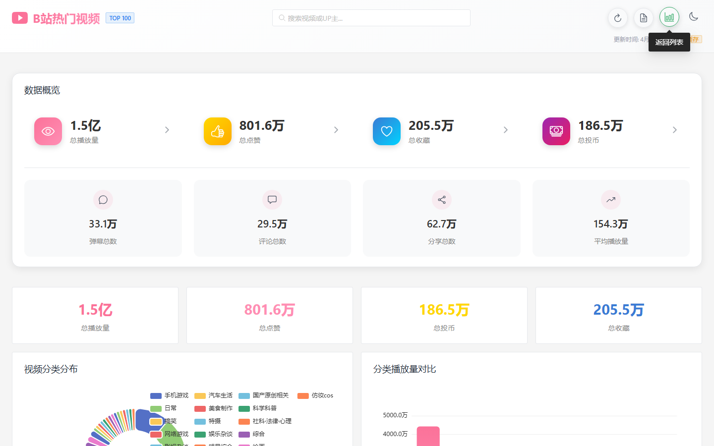

# B站热门视频 TOP 100

[中文](./README.md) · [English](./README_EN.md)


> B站热门视频排行榜，支持实时爬取、数据可视化、热榜分析

## ✨ 功能特点

- 📊 **热榜爬取** — 并发抓取 B站热门视频 TOP 100，实时更新
- 🖼️ **本地缓存** — 视频封面 / UP主头像按 URL hash 去重，避免重复下载
- 📈 **数据分析** — 播放量、点赞、投币、收藏、弹幕多维统计，ECharts 图表展示
- 🌙 **深色模式** — 支持明暗主题切换
- 📜 **实时日志** — WebSocket 推送爬取过程日志
- 📦 **一键启动** — Windows / macOS / Linux 全平台脚本，零配置运行

## 🖥️ 界面预览

### 视频列表页


### 数据分析页



## 🚀 快速开始

### 环境要求

| 环境 | 版本要求 |
|------|---------|
| Python | 3.8+ |
| Node.js | 16+ |
| 操作系统 | Windows 10+ / macOS 10.15+ / Ubuntu 18.04+ |

### 启动方式

**Windows:**
```bash
.\start-all.bat
```

**macOS / Linux:**
```bash
chmod +x start-all.sh
./start-all.sh
```

脚本会自动：
1. 检测并清理占用端口（3000 / 8000）
2. 创建 Python 虚拟环境，安装后端依赖
3. 安装前端 npm 包
4. 启动后端服务（FastAPI on :8000）和前端（Vite on :3000）
5. 自动打开浏览器访问

### 访问地址

| 服务 | 地址 |
|------|------|
| 前端界面 | http://localhost:3000 |
| 后端 API | http://localhost:8000 |
| API 文档 | http://localhost:8000/docs |

### 启动参数

```bash
# 仅启动前端
.\start-all.bat --frontend-only

# 仅启动后端
.\start-all.bat --backend-only

# 自定义数据目录
DATA_DIR=/custom/path .\start-all.sh --data-dir /custom/path

# 后台运行（AI 助手使用）
.\start-all.bat --detached
```

### 停止服务

```bash
# Windows
.\stop-all.bat

# macOS / Linux
./stop-all.sh
```

## 🛠️ 技术栈

### 后端

- **框架**: Python 3.8+ / FastAPI
- **爬虫**: aiohttp（异步并发）
- **图片缓存**: 按日期分目录存储，URL hash 去重
- **持久化**: SQLite + JSON 文件导出

### 前端

- **框架**: Vue 3 + TypeScript
- **构建**: Vite 5
- **UI 库**: Naive UI
- **图表**: ECharts 5
- **状态管理**: Pinia

## 📁 项目结构

```
bilibili-hot100/
├── bilibili-hot100-backend/       # Python FastAPI 后端
│   ├── main.py                   # 服务入口，API 路由
│   ├── requirements.txt          # Python 依赖
│   └── cache/                    # 图片缓存目录（运行时生成）
│       └── images/               # 按日期分目录
│
├── bilibili-hot100-vue3-ts/       # Vue3 前端
│   ├── src/
│   │   ├── api/                  # 后端 API 调用
│   │   ├── components/           # Vue 组件
│   │   ├── stores/               # Pinia 状态管理
│   │   ├── types/                # TypeScript 类型定义
│   │   └── utils/                # 工具函数
│   ├── package.json
│   └── vite.config.ts
│
├── start-all.bat / start-all.sh   # 一键启动脚本
├── stop-all.bat / stop-all.sh     # 停止脚本
└── docs/                         # 截图
```

## 🔧 API 接口

| 接口 | 方法 | 说明 |
|------|------|------|
| `/api/hot100` | GET | 获取热榜数据（`?force_refresh=true` 强制刷新）|
| `/api/refresh` | POST | 触发后台数据刷新 |
| `/api/status` | GET | 服务状态 |
| `/api/images/{date}/{file}` | GET | 获取缓存图片 |
| `/api/exports` | GET | 导出 JSON 文件列表 |
| `/api/logs` | GET | 历史日志 |
| `/api/logs/ws` | WebSocket | 实时日志流 |

## 🐛 常见问题

**端口被占用？**
```powershell
Get-NetTCPConnection -LocalPort 3000,8000 | ForEach-Object {
    Stop-Process -Id $_.OwningProcess -Force
}
```

**Python / Node 缺失？**
- Python: https://python.org
- Node.js: https://nodejs.org

**图片缓存失效？**
项目会自动维护 `downloaded_urls.json`，重启后可复用已有缓存，无需重新下载。

## 🤝 贡献

欢迎提交 Issue 和 Pull Request！请参见 [CONTRIBUTING.md](CONTRIBUTING.md)。

## 📄 许可证

[Apache License 2.0](LICENSE)
